# ECMA-418-2:2022 - Hearing Model of Sottek tonality, loudness and roughness sound quality metrics: Validation of MATLAB implementation
Validation of the MATLAB algorithms has been undertaken by comparison with outputs calculated using HEAD Acoustics ArtemiS v15.6 software.

The audio signals used for the validation comprise:
1. reference calibration signal for tonality and loudness: 1 kHz sinusoid at 40 dB sound pressure level (5 seconds, mono)
1. reference calibration signal for roughness: 1 kHz sinusoid modulated at 70 Hz (modulation factor 1), at 60 dB sound pressure level (5 seconds, mono)
1. binaural audio recording of a 'busy city street' environment, extracted from [EigenScape](https://zenodo.org/doi/10.5281/zenodo.1012808) database and reused under Creative Commons Attribution 4.0 licence (30 seconds, 2-channel binaural)

The reference calibration signals 1 and 2 were generated using [acousticHMSGenerateRefSignals.m](mlab/acousticHMSGenerateRefSignals.m).

The reference ArtemiS results are included in [reference folder](reference).

Calculated sound quality values and reference comparison figures were generated using the [validation script](mlab/acousticHMSValidation.m). The full set of comparison plots can be displayed by running the validation script; the selection presented below is sufficient to validate all capabilities of the algorithms.

Signal 1 is unmodulated, which yields 0 asper roughness, so time-dependent and specific roughnesses are not displayed.

# Tonality
## Time-dependent tonality

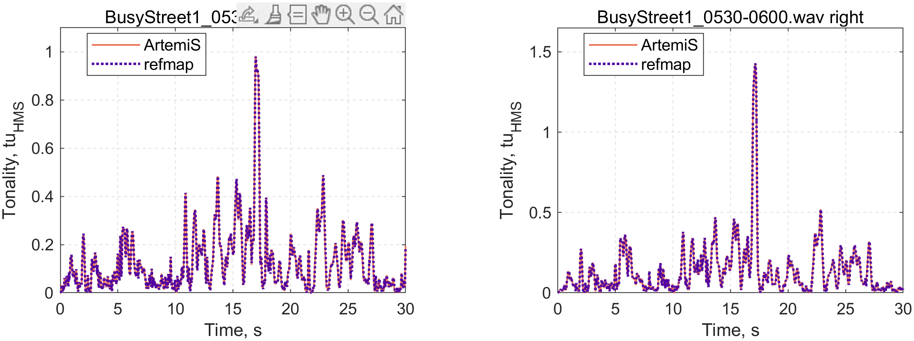

## Time-dependent specific tonality

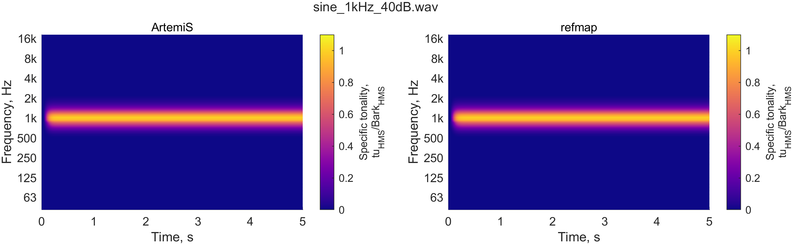

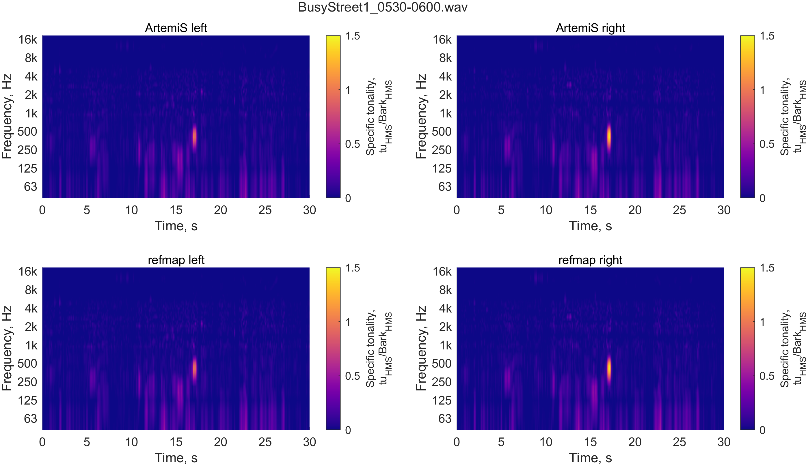

## Time-aggregated specific tonality

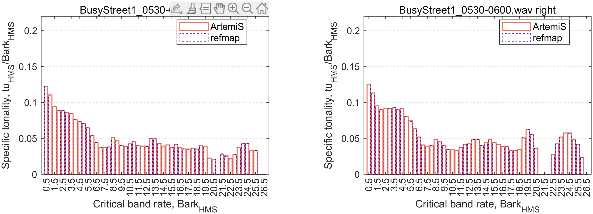

## Overall tonality

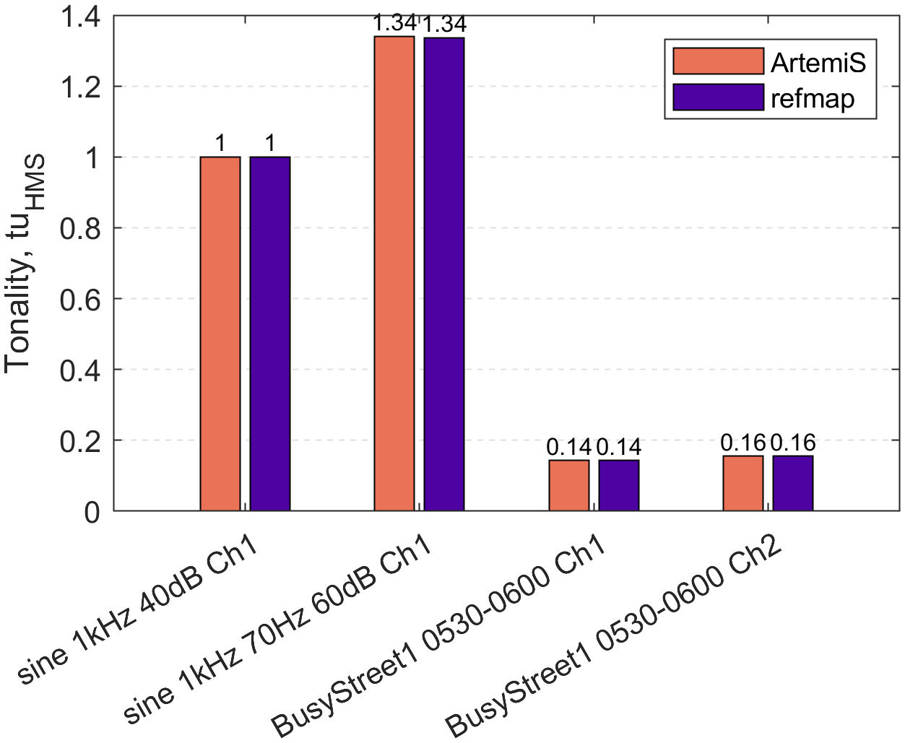

# Loudness
## Time-dependent loudness

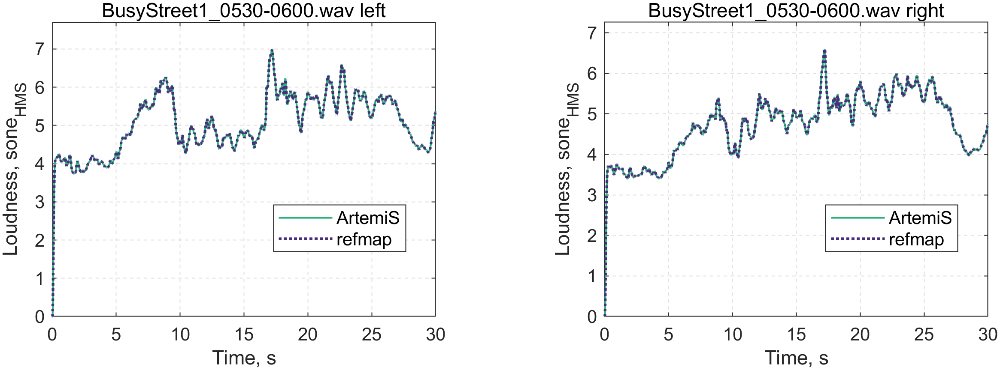

## Time-dependent specific loudness

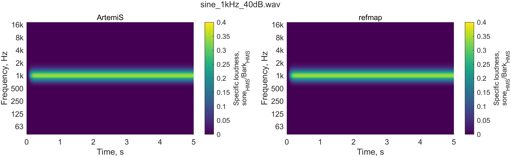

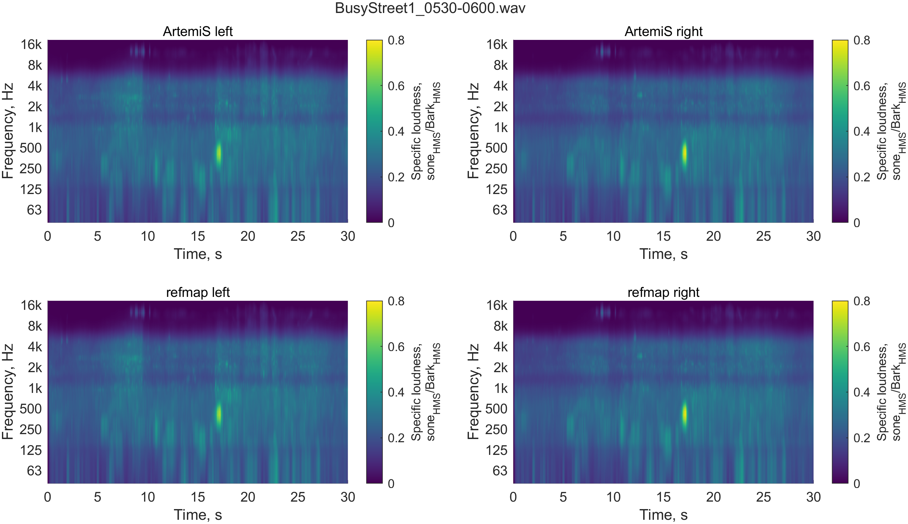

## Time-aggregated specific loudness

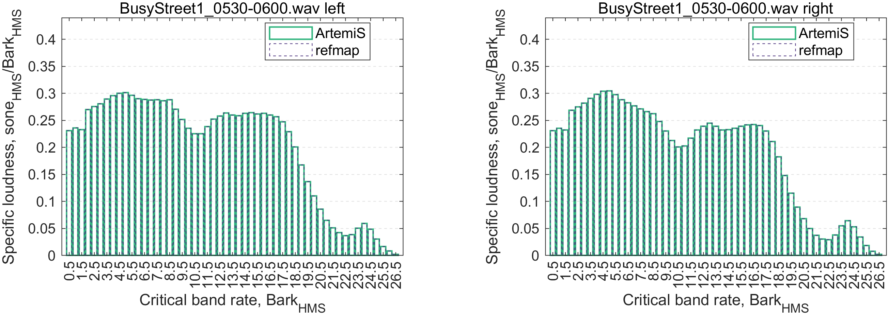

## Time-dependent specific binaural loudness

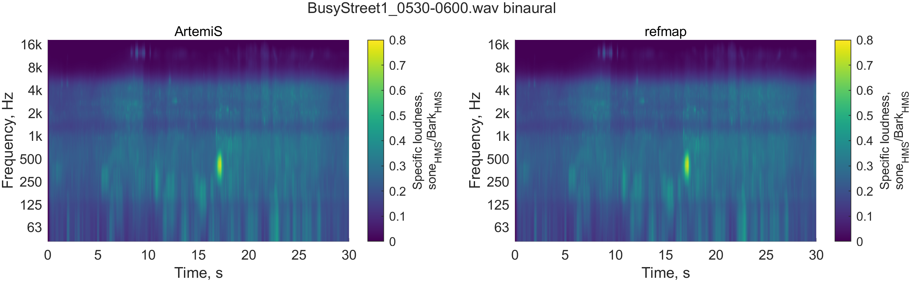

## Overall loudness

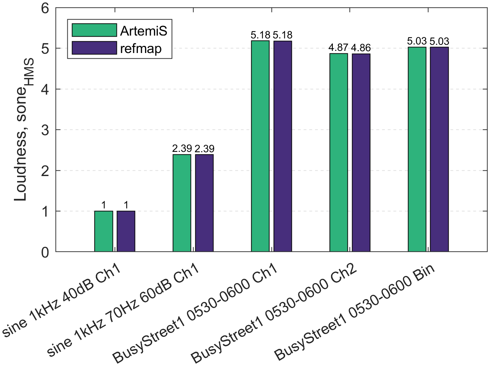

# Roughness
## Time-dependent roughness

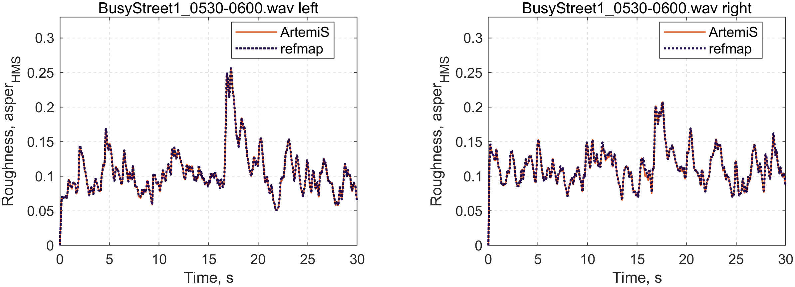

## Time-dependent specific roughness

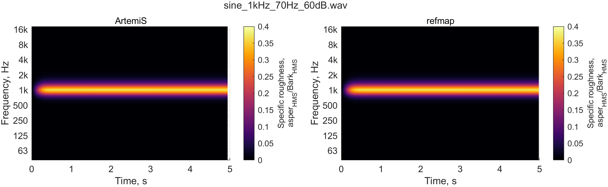

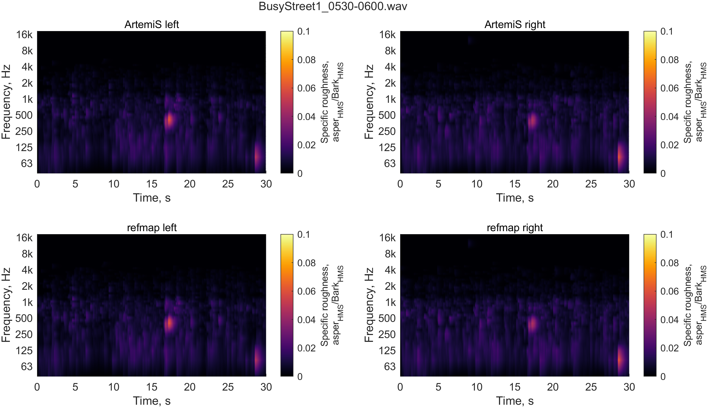

## Time-aggregated specific roughness

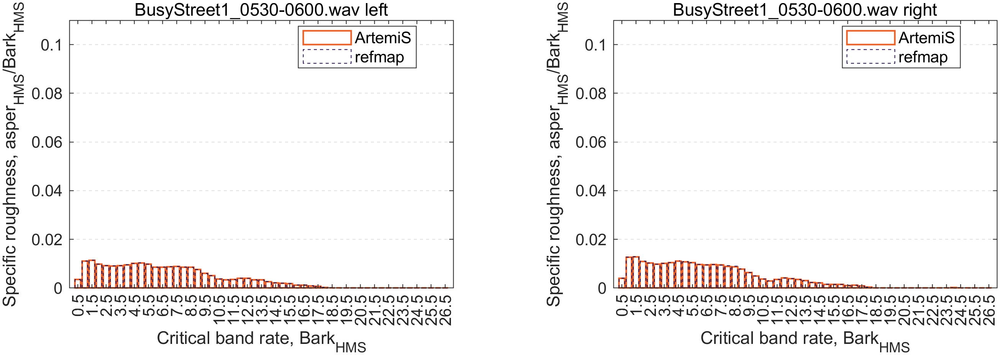

## Time-dependent specific binaural roughness

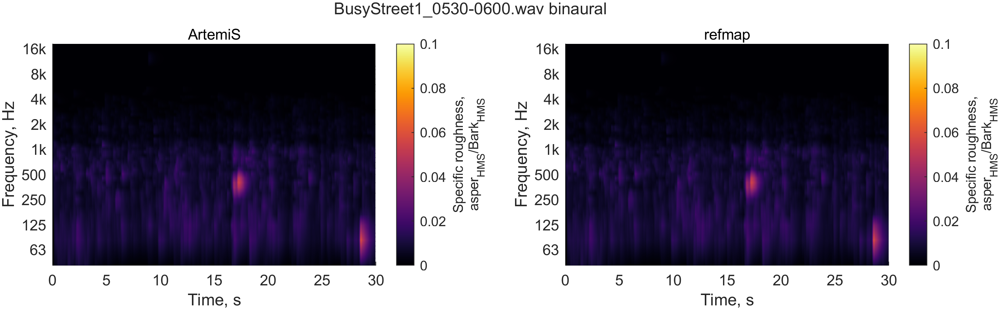

## Overall roughness

